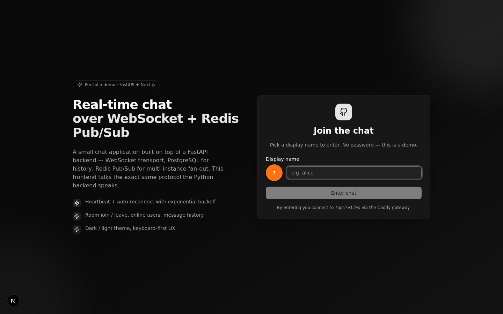
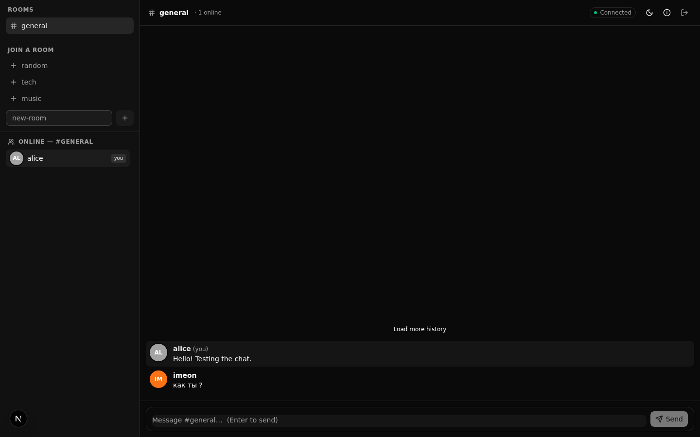
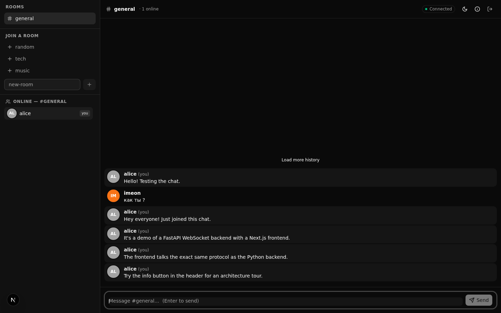
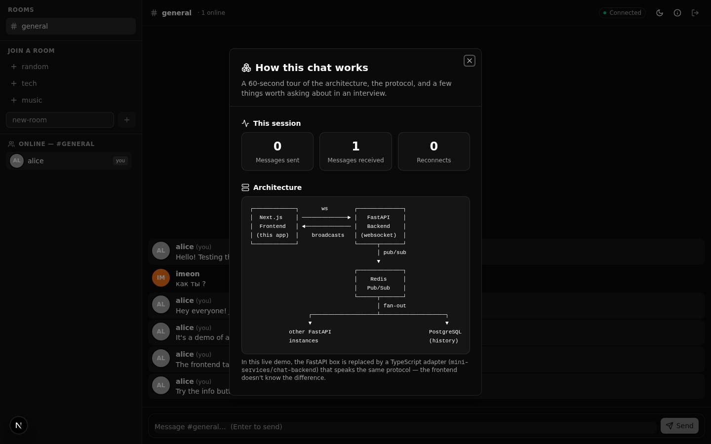
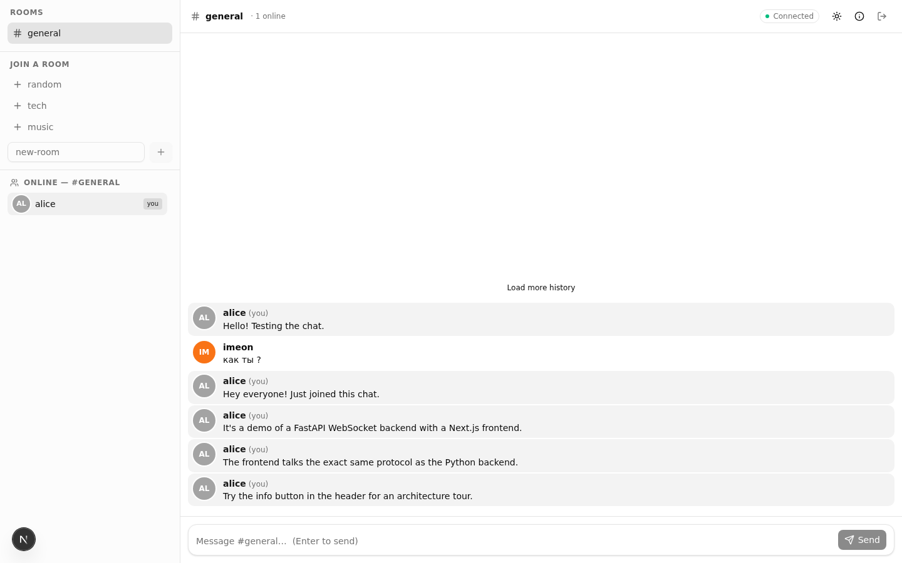
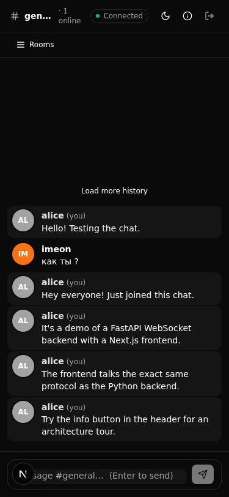

# Frontend — WebSocket Chat

[](https://github.com/imronaxl/websocket-chat/actions/workflows/frontend-ci.yml)

Next.js 16 + TypeScript frontend for the [WebSocket Chat API](../). Talks to
the FastAPI backend over plain WebSocket + REST, with auto-reconnect,
heartbeat, room management, and a portfolio-style "How this works" dialog.

## Screenshots

| Login screen | Chat — connected |
|:---:|:---:|
|  |  |

| Chat with messages | "How this works" modal |
|:---:|:---:|
|  |  |

| Light theme | Mobile |
|:---:|:---:|
|  |  |

> Screenshots live in [`docs/screenshots/`](../docs/screenshots/) at the repo root.

## What's here

```
frontend/
├── src/
│   ├── app/
│   │   ├── layout.tsx                                # Root layout, ThemeProvider, metadata
│   │   ├── page.tsx                                  # Single-route app — renders <ChatApp/>
│   │   ├── globals.css                               # Tailwind base + shadcn theme variables
│   │   └── api/v1/internal/ensure-backend/route.ts   # Next.js API route: spawn mini-service on demand
│   ├── components/
│   │   ├── chat/
│   │   │   ├── chat-app.tsx                          # Top-level orchestrator
│   │   │   ├── login-screen.tsx                      # Username entry
│   │   │   ├── chat-sidebar.tsx                      # Rooms + online users
│   │   │   ├── chat-header.tsx                       # Room name, status, theme, info
│   │   │   ├── chat-messages.tsx                     # Scrollable message log
│   │   │   ├── chat-message-item.tsx                 # One message (avatar + content)
│   │   │   ├── chat-message-input.tsx                # Composer (Enter to send)
│   │   │   ├── connection-status-badge.tsx
│   │   │   ├── system-event.tsx                      # "user joined/left" rows
│   │   │   ├── user-avatar.tsx                       # Deterministic color from username
│   │   │   └── architecture-dialog.tsx               # "How this works" modal
│   │   └── ui/                                       # shadcn/ui primitives
│   ├── hooks/
│   │   ├── use-chat-websocket.ts                     # WebSocket lifecycle (reconnect, heartbeat)
│   │   └── use-chat-state.ts                         # Rooms, messages, online users, REST fetches
│   └── lib/
│       ├── chat-types.ts                             # TS types mirroring backend Pydantic schemas
│       ├── chat-config.ts                            # URL builder, env-based config (demo vs backend)
│       ├── chat-protocol.ts                          # Message builders (buildJoin, buildChat, …)
│       ├── avatar.ts                                 # Deterministic color + initials from name
│       └── utils.ts                                  # cn() helper for Tailwind class merge
├── mini-services/
│   └── chat-backend/                                 # TS demo adapter (see its own README)
├── instrumentation.ts                                # Spawns the demo adapter on Next.js boot
├── instrumentation-node.ts                           # Node-only spawn logic (watchdog)
├── package.json
├── tsconfig.json
├── next.config.ts
├── postcss.config.mjs
├── eslint.config.mjs
└── components.json                                   # shadcn/ui config
```

## Running locally against the real Python backend

1. Start the backend (from the repo root):

   ```bash
   docker-compose up -d           # postgres + redis + app
   alembic upgrade head            # create tables
   ```

2. Start the frontend:

   ```bash
   cd frontend
   bun install
   NEXT_PUBLIC_CHAT_MODE=backend bun run dev
   ```

   In `backend` mode, `lib/chat-config.ts` skips the `XTransformPort`
   query param and uses absolute URLs based on `NEXT_PUBLIC_CHAT_API_BASE`
   (defaults to `http://localhost:8000`).

3. Open http://localhost:3000 and pick a display name.

## Running the demo (no Python needed)

If you just want to see the UI without booting Postgres + Redis + FastAPI,
the `mini-services/chat-backend` folder contains a TypeScript adapter that
speaks the exact same WebSocket protocol as the Python backend. The
`instrumentation.ts` hook spawns it automatically when Next.js boots.

```bash
cd frontend
bun install
bun run dev          # spawns the adapter automatically
```

## Architecture

See the in-app "How this works" dialog (info button in the chat header) for
a visual diagram. Short version:

```
┌─────────────┐       ws        ┌──────────────┐
│  Next.js    │ ──────────────► │   FastAPI    │
│  Frontend   │ ◄────────────── │   Backend    │
│ (this app)  │    broadcasts   │ (websocket)  │
└─────────────┘                 └──────┬───────┘
                                       │ pub/sub
                                       ▼
                                ┌──────────────┐
                                │    Redis     │
                                │   Pub/Sub    │
                                └──────┬───────┘
                                       │ fan-out
                  ┌────────────────────┴────────────────────┐
                  ▼                                         ▼
            other FastAPI                              PostgreSQL
            instances                                  (history)
```

In the demo, the FastAPI box is replaced by the TS adapter in
`mini-services/chat-backend`. The frontend code is unchanged.

## Key design decisions

- **Plain WebSocket, not Socket.io.** The Python backend uses Starlette's
  `WebSocket` directly. Socket.io would have required a different server
  and added a transport layer that doesn't match production.
- **Adapter pattern for transport.** `lib/chat-config.ts` switches between
  demo mode (TS adapter, relative URL + `XTransformPort`) and backend mode
  (Python, absolute URL) via a single env var. The rest of the codebase
  doesn't know which one it's talking to.
- **Single hook owns the WebSocket.** `useChatWebSocket` handles connect,
  reconnect-with-backoff, heartbeat, and message dispatch. It does NOT
  manage chat state — that's `useChatState`'s job, which keeps the WS
  hook small and easy to read.
- **Ref-based send in the state hook.** `useChatState` needs to call
  `send` (returned by `useChatWebSocket`) from inside `handleStatusChange`
  (passed INTO `useChatWebSocket`). To avoid a circular dependency, we
  store `send` in a ref and sync it on every render. Same pattern the WS
  hook uses internally for its reconnect loop.
- **No global state store.** State flows top-down through props from
  `ChatApp` → child components. For an app this size, a global store
  (Zustand/Redux) would add ceremony without payoff.
- **Plain div for the message list, not shadcn ScrollArea.** ScrollArea
  hides its viewport behind a Radix primitive that doesn't expose a ref in
  the shadcn wrapper. We need scroll-position access for auto-scroll + the
  "jump to bottom" button, so a plain `overflow-y-auto` div is simpler.
- **Status changes drive auto-join, not effects.** When the WS transitions
  to "connected", we auto-join `general` (first connect) or rejoin all
  previously-joined rooms (reconnect). This logic lives in the
  status-change callback, not a `useEffect`, because it's a side effect of
  a state machine transition — putting it in an effect would couple it to
  React's render cycle in a confusing way.

## What's intentionally NOT here

- **Auth UI.** The backend's WS endpoint takes `user_id` + `username` as
  query params; JWT helpers exist in `app/services/auth.py` but aren't
  wired into the WS endpoint. We don't pretend they are.
- **Markdown rendering.** The backend stores message content as-is. To
  avoid XSS in a demo, content is rendered as plain text with
  `whitespace-pre-wrap`. In production you'd want server-side sanitization.
- **Real cursor pagination.** The backend's REST endpoint returns the last
  N messages, no cursor. The "Load more history" button just re-fetches.

## Talking points for an interview

Open the "How this works" dialog in the running app — it has a short list
of things worth asking about (Redis Pub/Sub for multi-instance fan-out,
heartbeat + reconnect strategy, why the online list shows user_ids, XSS
considerations, what's missing for a real product).

## Scripts

| Command | Description |
|---------|-------------|
| `bun run dev` | Start Next.js dev server (spawns demo adapter via instrumentation) |
| `bun run build` | Production build |
| `bun run start` | Run production server |
| `bun run lint` | ESLint |
| `cd mini-services/chat-backend && bun run dev` | Run demo adapter standalone |
